<div align="center">



**[0] whoami\*&nbsp;&nbsp;&nbsp;[1] skills&nbsp;&nbsp;&nbsp;[2] projects&nbsp;&nbsp;&nbsp;[3] status&nbsp;&nbsp;&nbsp;[4] contact**&nbsp;&nbsp;·&nbsp;&nbsp;120×32&nbsp;&nbsp;·&nbsp;&nbsp;zsh

</div>

<br>

<!-- ══════════ PANE 0 — whoami ══════════ -->


<table width="100%">
<tr>
<td width="68%" valign="top">

```console
$ whoami
karima — DevOps & SRE Engineer

$ cat philosophy.txt
Infrastructure should be automated, observable and boring.
If it's exciting, it's probably an incident.

$ echo $CURRENT_FOCUS
platform-reliability · gitops-delivery · alerts→root-cause

$ uptime
up 4 years,  load average: 0.42, 0.31, 0.28
```

</td>
<td width="32%" align="center" valign="top">


`[LIVE]` 🟢

[](https://github.com/KarimaTaira)


</td>
</tr>
</table>

<div align="center">


</div>

<br>

<!-- ══════════ PANE 1 — skills ══════════ -->


```console
$ ls -l ./skills --group-by=domain

drwxr-xr-x  cloud-infra/     aws · terraform · kubernetes(eks) · helm · kustomize
drwxr-xr-x  delivery/        github-actions · argo-cd · gitops · release-eng
drwxr-xr-x  observability/   prometheus · grafana · opentelemetry · loki · tempo
drwxr-xr-x  reliability/     slo-design · alerting · incident-response · triage

4 directories, 21 tools

$ tree ./stack -L 1
stack/
├── cloud/          aws · terraform · eks
├── containers/     docker · kubernetes · helm
├── delivery/       github-actions · argo-cd
├── observability/  prometheus · grafana · loki · tempo
├── languages/      python · bash
└── data/           postgres · nginx
```

<br>

<!-- ══════════ PANE 2 — projects ══════════ -->


```console
$ git log --stat --author=karima --oneline

a3f9c21  feat(cloud-infra): AWS/EKS platform, IaC end-to-end
         terraform/  eks/  modules/          | 128 ++++++++++++++++++
         → reliability, cost optimization, automation over manual toil

7b2e440  feat(observability): metrics, logs and distributed traces
         prometheus/  grafana/  tempo/       |  96 ++++++++++++
         → incident diagnosis: hours → minutes

e51d8a3  feat(gitops): Argo CD delivery pipeline
         argocd/  helm/  .github/workflows/  |  74 +++++++++
         → every release repeatable, reviewable, reversible

3 commits, 3 files changed, 298 insertions(+)
```

<br>

<!-- ══════════ PANE 3 — status ══════════ -->


```console
$ systemctl status karima.service

● karima.service — DevOps & SRE Engineer
     Loaded: loaded (/etc/systemd/system/karima.service; enabled)
     Active: active (running)
   Main PID: 1337 (kubectl)
     Status: "watching prod, sleeping fine"

$ tail -f ~/status.log
```

<div align="center">


</div>

<br>

<!-- ══════════ PANE 4 — contact ══════════ -->


```console
$ curl -s https://karima.dev/health | jq
{
  "cloud":          "ok",
  "kubernetes":     "ok",
  "cicd":           "ok",
  "observability":  "ok",
  "coffee":         "critical"
}

$ connect --with=karima
resolving endpoints... 3 found
```

<div align="center">

**[`→ linkedin`](https://www.linkedin.com/in/KarimaTaira)** &nbsp;&nbsp;·&nbsp;&nbsp; **[`→ email`](mailto:taira.karima21@gmail.com)** &nbsp;&nbsp;·&nbsp;&nbsp; **[`→ github`](https://github.com/KarimaTaira)**

</div>

<br>

<div align="center">

**[0] whoami&nbsp;&nbsp;&nbsp;[1] skills&nbsp;&nbsp;&nbsp;[2] projects&nbsp;&nbsp;&nbsp;[3] status\*&nbsp;&nbsp;&nbsp;[4] contact**&nbsp;&nbsp;·&nbsp;&nbsp;karima@devops-01&nbsp;&nbsp;·&nbsp;&nbsp;exit 0

<sub>built with ☕, YAML, and a questionable amount of `kubectl`.</sub>

</div>

